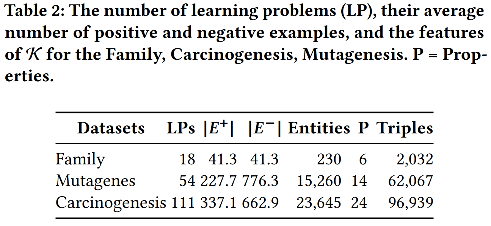
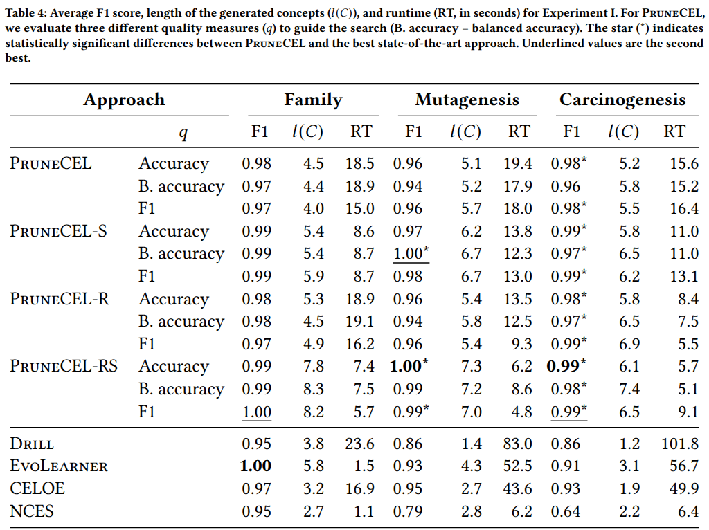
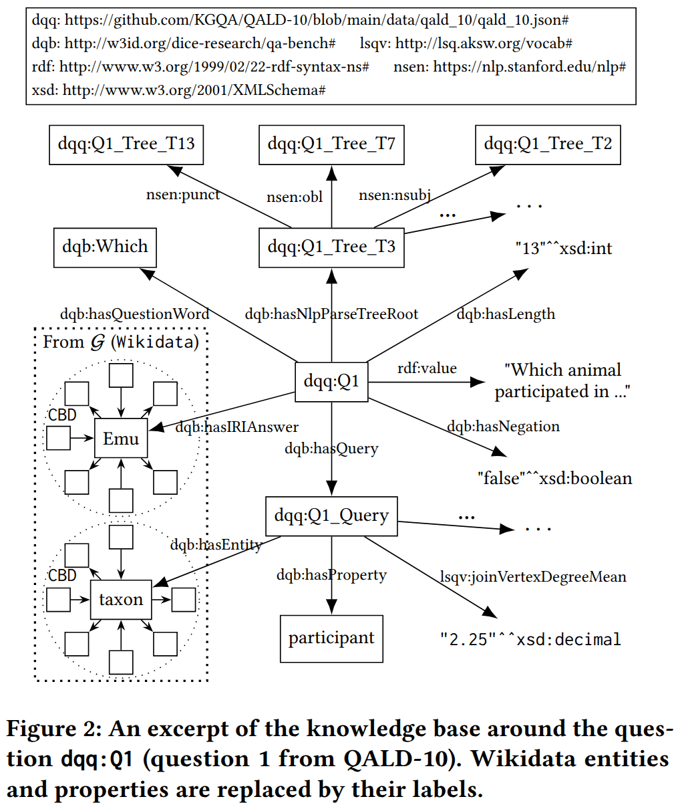
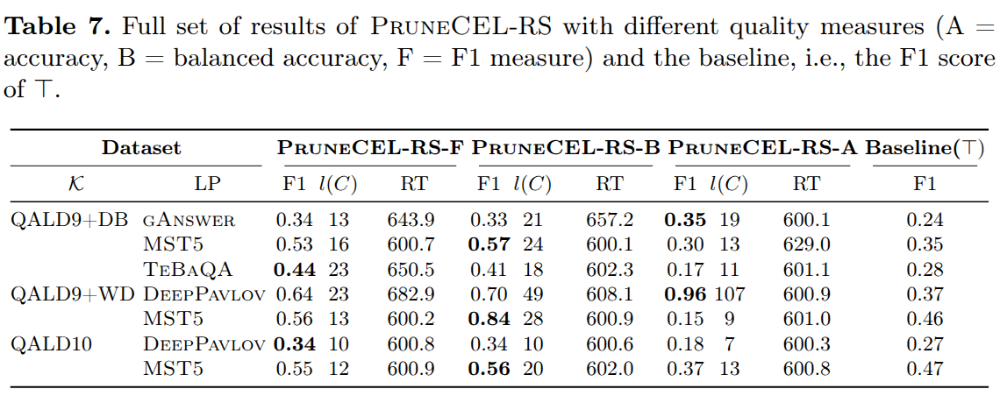

# Explainable Benchmarking through the Lense of Concept Learning
This repository contains 
* The source code of our concept learning approach PruneCEL
* Comparison between PruneCEL and other learners on family, mutagenesis and carcinogenesis datasets
* Links and descriptions to rerun Experiments I 
* The survey and its results of Experiment II


## Table of Contents
1. [Repository Structure](README.md#1-repository-structure)
2. [Running Experiments](README.md#2-running-experiments)
3. [PruneCEL Compare With State-of-the-art learners](README.md#3-prunecel-compare-with-state-of-the-art-learners)
4. [Knowledge Base Details](README.md#4-knowledge-base-details)
5. [Run Experiment I](README.md#5-run-experiment-i)
6. [Details Experiment II](README.md#6-details-experiment-ii)
7. [Reference](README.md#7-references)


## 1. Repository Structure
The following directories and files can be found within this project:
```
- Doc/Pic:                   Pictures used in this README
- T_F_Json:                  The learning problems of Experiment I 
- Experiment_II_Survey.pdf:  Details of the survey in Experiment II
- src:                       The Java source code of PruneCEL
- pom.xml:                   File necessary to compile PruneCEL with Maven
```

## 2. Running Experiments

### Experiment Setup

PruneCEL uses SPARQL queries to retrieve data from the underlying knowledge base. 
For our experiments, we used the triple store [Tentris](https://github.com/dice-group/Tentris). However, the experiments can be run with any other triple store ([Fuseki](https://jena.apache.org/documentation/fuseki2/)).
However, using a different triple store can lead to different results since PruneCEL moves a large amount of the work to the triple store, serving as oracle.

For our experiments, we relied on the implementations of the approaches CELOE, Drill, EvoLearner and NCES from the [Ontolearn](https://github.com/dice-group/ontolearn) project. We refer to this project with respect to the execution of these approaches. During our experiments, CELOE and DRILL were set up in a similar way as PruneCEL, i.e., we provided the address of the SPARQL endpoint and both approaches used SPARQL queries to retrieve the necessary data. However, the implementations of EvoLearner and NCES do not seem to support this feature at the moment and both have to load the data into memory before they start. Note that we did not take this loading time into consideration when measuring the runtime of these approaches.

### Compiling PruneCEL

PruneCEL is a Maven project and after downloading this repository, PruneCEL can be compiled using the following command:
```sh
mvn clean package
```
The result of the compilation and packaging process is available as `target/prune-cel-0.0.1-SNAPSHOT.jar`.

## 3. PruneCEL compare with state-of-the-art learners

### Overview

We compare PruneCEL to CELOE, Drill, Evolearner, and NCES on the three benchmarking datasets Family, Carcinogenesis and Mutagenesis with the learning problems created by Kouagou et al[NCES].
We run all approaches with their default configuration and set their maximum runtime for a single learning problem to 60 seconds.
We compare their results using the F1-measure, the concept length and their runtime.
In this experiment, we evaluate 12 different configurations of PruneCEL. We evaluate the base version of PruneCEL and its S and R extensions as well their combination (RS).
Each of these variants is evaluated using three different measures ℎ as part of the scoring function, namely accuracy, balanced accuracy and F1 measure. In all configurations, we set $\eta=0.1$.
### Data

The [Ontolearn project](https://github.com/dice-group/Ontolearn) made the knowledge bases of the three benchmarking datasets for concept learning [available online](https://files.dice-research.org/projects/Ontolearn/KGs.zip). It can be downloaded using the following command:
```shell
wget https://files.dice-research.org/projects/Ontolearn/KGs.zip -O ./KGs.zip && unzip KGs.zip
```
The file contains the three knowledge bases of the first experiment. The knowledge base that you want to use has to be loaded into a triple store.
Table 2 shows the datasets' features(Family, Mutagenesis and Carcinogenesis).



### PruneCEL

After compiling PruneCEL, it can be executed using the following command:
```shell
java -cp target/prune-cel-0.0.1-SNAPSHOT.jar org.dice_research.cel.PruneCEL_CLI \
--sparqlUrl http://localhost:9020/sparql \
--ontology ALC \
--accuracyfunction 0 \
--punishLongExpression true \
--avoidPickySolutionsDecorator true \
--iteration 0 \
--time 60000 \
--recursive true \
--skipNone true \
--inputFile T_F_Json/Carcinogenesis/lps.json \
--outputFile Results/Carcinogenesis/Carcinogenesis110.csv \
--cluster false \
--folds 1 \
--foldTrainTestSavePath Fold/Carcinogenesis
```
The command has to be adapted as follows:
* `sparqlUrl` has to be changed to to your own SPARQL endpoint containing the knowledge base
* `accuracyfunction` to 0, 1 or 2, where 0 is F1, 1 is Balance Accuracy, 2 is Accuracy;
* `recursive` can be set to true or false, controlling the -R extension;
* `skipNone` can be set to true or false, controlling the -S extension;
* `intputFile` has to point to the JSON file containing the learning problems. The JSON files can be found in the `T_F_Json` directory
* `outputFile` defines a path where the results will be stored.

The other settings should be left as they are.

### Other Algorithms

Thankfully, the Ontolearn project provides [examples](https://github.com/dice-group/Ontolearn/tree/develop/examples) how to execute the related work approaches (CELOE, Drill, EvoLearner and NCES) on the benchmarking datasets.

### Results



Experiments on the Family was ran on a server (AMD EPYC 7282, 252 GB RAM). Experiments on the Mutagenesis and Carcinogenesis were ran on a laptop (Intel i7-13700H, 31 GB RAM).

The results of the experiment listed in Table 4 show that PruneCEL significantly outperforms state-of-the-art concept learners on the Mutagenesis and Carcinogenesis datasets, and achieves a similar performance as the best-performing concept learner on the Family dataset (i.e., without a significant difference). We use the Student’s t-test with $\alpha=0.05$ assuming that the F1 scores of the single learning problems follow a normal distribution.

With respect to the average runtime, PruneCEL is slower than the fastest state-of-the-art concept learners on the Family dataset, but especially PruneCEL-RS achieves very good runtimes on the two larger datasets.

Comparing the variants of our approach, PruneCEL-R is rarely better than the base version but returns results faster on Mutagenesis and Carcinogenesis. PruneCEL-S achieves slightly higher average F1 scores and lower runtimes than the base version.
PruneCEL-RS is often the best of our approach variants.

## 4. Knowledge Base Details

In this section, we want to give some more details about the knowledge bases that we created for the 3 QA benchmarks ([QALD 9 plus](https://github.com/KGQA/QALD_9_plus) DBpedia, QALD 9 plus Wikidata and [QALD 10](https://github.com/KGQA/QALD-10/)) and the two reference knowledge graphs ([DBpedia](https://downloads.dbpedia.org/2016-10/core-i18n/en/) and [Wikidata](https://zenodo.org/records/7496690)).

### Preprocessing

We remove all questions from the three QA datasets that have an empty ground truth answer set.

We preprocessed the DBpedia reference graph by removing $43,618$ triples with IRIs that do not pass through the RDF checker. We also removed properties of the `http://dbpedia.org/property/` namespace. 
Additionally, we inferred the classes of all entities based on the class hierarchy.


We preprocessed Wikidata by replacing the property `http://www.wikidata.org/prop/direct/P31` with `http://www.w3.org/1999/02/22-rdf\textbackslash-syntax-ns\#type`.


## Knowledge Base Structure

In the first step of our benchmarking framework, we generate a knowledge graph comprising information from the dataset used during the benchmarking process. Our work relies on the QALD datasets, which include three types of data for each question:
1. **Natural language question.** Each question comes with a representation in several languages. From the English question, we extract linguistic features such as
   * The length of the question(`dqb:hasLength`),
   * The presence of negation(`dqb:hasNegation`),
   * The question word(`dqb:hasQuestionWord`),
   * The NLP parse tree(`dqb:hasNlpParseTreeRoot`), We employ the Stanford NLP toolkit for the extraction.
3. **Answer(s).** Each question comes with the ground truth answers. We add these answers to the generated graph with three different properties distinguishing IRI answers(`dqb:hasIRIAnswer`), boolean answers(`dqb:hasBooleanAnswer`) and other literal answers(`dqb:hasLiteralAnswer`).
    For each IRI listed as answer, we add its concise bounded description (CBD) extracted from the reference knowledge graph.
4. **SPARQL query.** Each question has a SPARQL query that returns the ground truth answer when used on the reference knowledge graph. We adopt LSQ to add the following SPARQL query features to our knowledge graph:
   * Entities(`dqb:hasEntity`), properties(`dqb:hasProperty`) contained in the query and the CBD of the entities,
   * Type of query,
   * The number of triple patterns,
   * The number of basic graph patterns, 
   * The average degree of vertices, 
   * The median degree of vertices involved in join operations,
   * The minimum, maximum, and median number of triple patterns in a basic graph pattern, and
   * The presence of certain keywords such as `FILTER`, `DISTINCT`, and `GROUP BY`.

The following figure shows an example question (Question 1 from QALD10) and the data that we collected for such a question, each question is represented by an IRI in the form `dqq:QX`, where `X` denotes the question's serial number.




## 5. Run Experiment I
The knowledge bases for the QALD datasets can be found at [DOI: 10.5281/zenodo.14720669](https://doi.org/10.5281/zenodo.14720669). The learning problems can be found at [DOI: 10.5281/zenodo.16681824](https://doi.org/10.5281/zenodo.16681824).
Again, the chosen knowledge base has to be loaded into a triple store.

### PruneCEL

The same command as mentioned before can be used. Only the paths have to be adapted and the `--time` parameter (in seconds) should be set to a higher value, `600000`.

The table 7 presents the complete set of results for PruneCEL-RS on experiment I.



### Other Algorithms

Again, we refer to the [examples](https://github.com/dice-group/Ontolearn/tree/develop/examples) of the Ontolearn project. However, Drill needs an embedding model for each knowledge base. The models we used can be found at [DOI: 10.5281/zenodo.14720609](https://doi.org/10.5281/zenodo.14720609). We also provide a pre-trained model for Drill [DOI: 10.5281/zenodo.14720524](https://doi.org/10.5281/zenodo.14720524)

The following table gives an overview of the parameters, that we use to calculate the [Keci embeddings](https://github.com/dice-group/dice-embeddings).

| **Parameters**     | **QALD9+DB** | **QALD9+WD** | **QALD10** |
|---|---|---|---|
| Model | Keci | Keci | Keci |
| Dimensions | 8 | 8 | 32 |
| Learning rate | 0.1 | 0.1 | 0.1 |
| Epochs | 1 | 1 | 1 |
| Batch size | 512 | 512 | 50000 |
| Optimization function | Adam | Adam | Adam |
| Evaluation mode | None | None | None |
| Complete command | `dicee --dataset_dir  KGs/QALD9_DB --model Keci --embedding_dim 8 --lr 0.1  --save_embeddings_as_csv --num_epochs 1  --batch_size 512 --optim Adam --scoring_technique NegSample --eval_mode None`   | `dicee --dataset_dir  KGs/QALD9_WK --model Keci --embedding_dim 8 --lr 0.1  --save_embeddings_as_csv --num_epochs 1  --batch_size 512 --optim Adam --scoring_technique NegSample --eval_mode None` | `dicee --dataset_dir  KGs/QALD10 --model Keci --embedding_dim 32 --lr 0.1  --save_embeddings_as_csv --num_epochs 1  --batch_size 50000 --optim Adam --scoring_technique NegSample --eval_mode None` |

## 6. Details Experiment II

First, we chose two concepts learned on the QALD10 and QALD9+DB. We decided to use the concept learned for the learning problem for which PruneCEL had the largest difference to the baseline approach (which would be the top concept). We verbalized these two concepts using ChatGPT.
After that, we used the verbalizations to conduct a survey as described in our paper.

### Verbalization

#### QALD 10 MST5

The following concept has been learned by PruneCEL:
```
∃http://w3id.org/dice-research/qa-bench#hasIRIAnswer.(
    http://www.wikidata.org/entity/Q482994
    ⊔
    ∃http://www.wikidata.org/prop/direct/P7763.⊤
    ⊔
    http://www.wikidata.org/entity/Q28640
    ⊔
    ∃http://www.wikidata.org/prop/direct/P131.¬http://www.wikidata.org/entity/Q6256
    ⊔
    ∃http://www.wikidata.org/prop/direct/P1557.⊤
  )
⊔
∃http://w3id.org/dice-research/qa-bench#hasBooleanAnswer.⊤
```
We replaced all IRIs with their English labels and created the following prompt for ChatGPT:
```
A question answering system "QAS1" is able to answer questions that fulfill the following DL expression:
(∃has entity answer.(album⊔∃copyright status as a creator.⊤⊔profession⊔∃located in the administrative territorial entity.¬country⊔∃manifestation of.⊤)⊔∃has boolean answer.⊤)
Explain that in simple words. Keep your answer short.
```
Verbalization:
```
The system "QAS1" can answer questions if:

1. There’s an answer involving an *album*, a *creator's copyright status*, a *profession*, a location that’s *not a country*, or something that has a *type or form*.
2. Or, it can answer questions that have a simple *yes/no (boolean) answer*.
```

#### QALD9+DB MST5

The following concept has been learned by PruneCEL:
```
(
  ∃http://w3id.org/dice-research/qa-bench#hasIRIAnswer.(
    (
      ¬http://www.ontologydesignpatterns.org/ont/dul/DUL.owl#Agent
      ⊓
      ∃http://dbpedia.org/ontology/parentMountainPeak.⊤
    )
    ⊔
    http://www.wikidata.org/entity/Q41176
  )
  ⊔
  (
    ∃http://w3id.org/dice-research/qa-bench#hasIRIAnswer.(
      http://dbpedia.org/ontology/Astronaut
      ⊔
      (
        ¬http://www.wikidata.org/entity/Q24229398
        ⊓
        ¬http://www.w3.org/2003/01/geo/wgs84_pos#SpatialThing
      )
    )
    ⊓
    ∃http://w3id.org/dice-research/qa-bench#hasQuestionWord.⊤
  )
)
```
We replaced all IRIs with their English labels and created the following prompt for ChatGPT:
```
A question answering system "QAS2" is able to answer questions that fulfill the following DL expression:
(∃http://w3id.org/dice-research/qa-bench#has entity answer.((¬agent⊓∃parent mountain peak.⊤)⊔building)⊔(∃has entity answer.(astronaut⊔(¬agent⊓¬spatial thing))⊓∃has question word.⊤))
Explain that in simple words. Keep your answer short.
```
Verbalization:
```
The system "QAS2" can answer questions if:

1. The answer involves either:
   - A *non-agent* (not a person or entity with intent) with a *parent mountain peak*, or
   - A *building*.
2. Or, if the answer involves:
   - An *astronaut*, or
   - A *non-agent, non-spatial entity* (something that’s neither a person nor a physical location),
   - And if the question includes a question word (like "who," "what," or "where").
```

### Survey

The survey and the detailed results can be found in the file `Experiment_II_Survey.pdf` within this repository.


## 7. References

[NCES] N’Dah Jean Kouagou, Stefan Heindorf, Caglar Demir, and Axel-Cyrille Ngonga Ngomo.  
*Neural Class Expression Synthesis*. In *The Semantic Web*. Springer Nature Switzerland, Cham, 2023, pp. 209–226.  
Available at: https://link.springer.com/chapter/10.1007/978-3-031-33443-5_13

[CELOE] Jens Lehmann, Sören Auer, Lorenz Bühmann, and Sebastian Tramp.  
*Class expression learning for ontology engineering*. Journal of Web Semantics, 9(1):71–81, 2011.  
https://doi.org/10.1016/j.websem.2011.01.001  
Available at: https://www.sciencedirect.com/science/article/pii/S1570826811000023

[Drill] Caglar Demir and Axel-Cyrille Ngonga Ngomo.  
*Neuro-symbolic class expression learning*.  
In *Proceedings of the Thirty-Second International Joint Conference on Artificial Intelligence (IJCAI '23)*, Macao, P.R. China, 2023.  
https://doi.org/10.24963/ijcai.2023/403  
Available at: https://doi.org/10.24963/ijcai.2023/403

[Evolearner] Stefan Heindorf, Lukas Blübaum, Nick Düsterhus, Till Werner, Varun Nandkumar Golani, Caglar Demir, and Axel-Cyrille Ngonga Ngomo.  
*EvoLearner: Learning Description Logics with Evolutionary Algorithms*.  
In *Proceedings of the ACM Web Conference 2022 (WWW '22)*, Virtual Event, Lyon, France, pp. 818–828. Association for Computing Machinery, New York, NY, USA, 2022.  
https://doi.org/10.1145/3485447.3511925  
Available at: https://doi.org/10.1145/3485447.3511925

