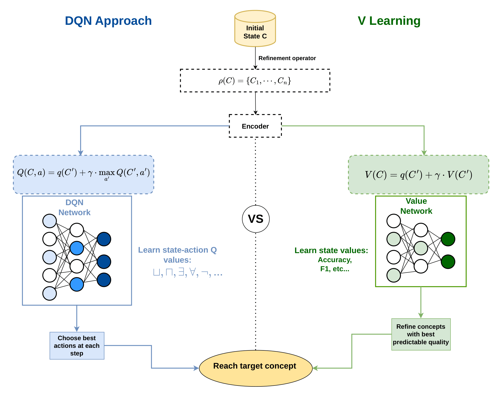
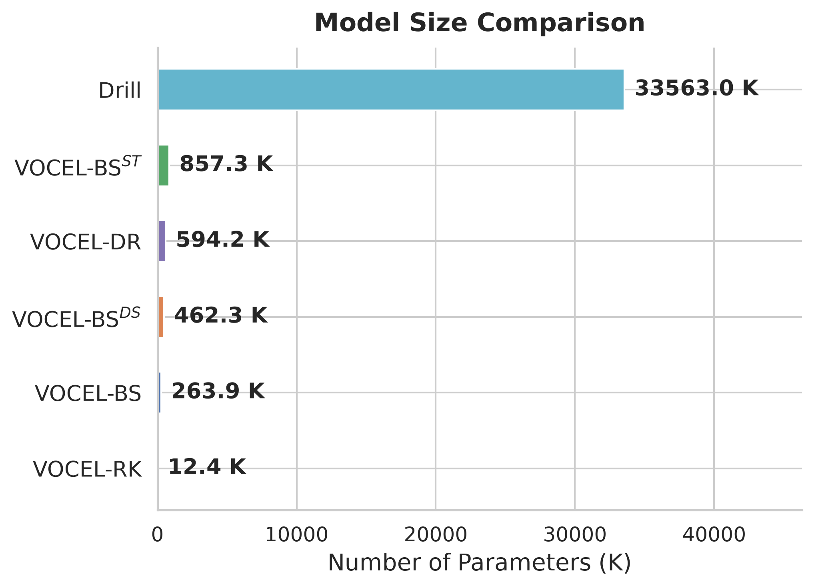
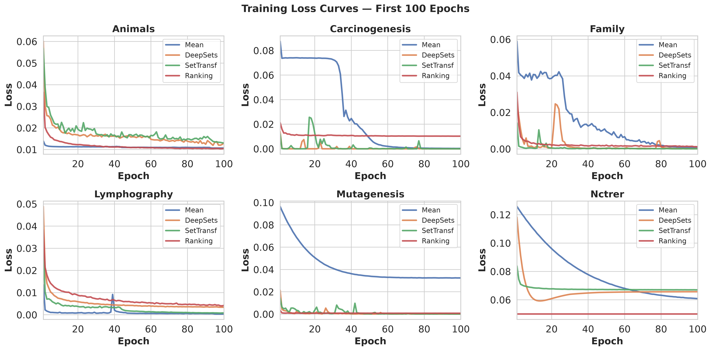
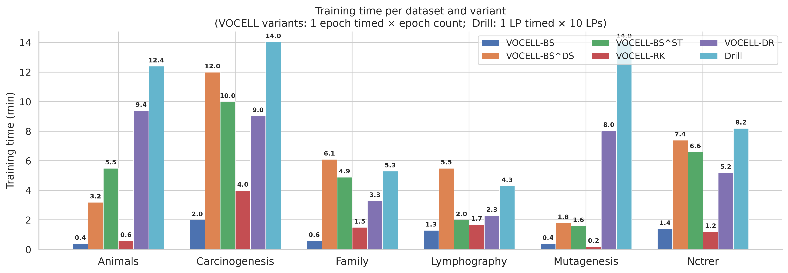
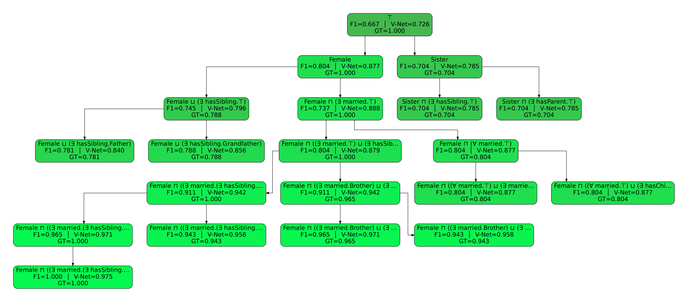

# VOCEL — Value-oriented Class Expression Learning

> **VOCEL** is a concept-learning algorithms that use a lightweight
> offline-trained **V-Network** to guide beam search, dramatically reducing the number
> of concepts explored while maintaining high solution quality.

---

## Conceptual Overview

The figure below illustrates the key difference between standard neural concept learners
and our V-Net guided approach.  Standard learners evaluate *every* refinement; the V-Net
scores candidates *before* evaluation and prunes dead-end branches early.



---

## Algorithms

### VOCEL-BS (`vocell.py`)
A bootstrap-trained V-Net used as a **beam filter** during class-expression search.
The V-Net predicts the best-reachable F1 from each candidate concept and prunes
low-promise branches before the expensive SPARQL evaluation step.
Three aggregation variants are provided:

| Variant | Aggregator | Checkpoint suffix |
|---------|-----------|-------------------|
| VOCEL-BS | mean pooling | `*_mean/` |
| VOCEL-BS<sup>DS</sup> | DeepSets | `*_DS/` |
| VOCEL-BS<sup>ST</sup> | SetTransformer | `*_ST/` |

### VOCEL-RK (`vocell.py` — ranking mode)
Same architecture as VOCEL-BS but trained with a **pairwise ranking loss**
(checkpoint suffix `*_ranking/`).

### VOCEL-DR (`drillv_variants.py`)
Compact V-learning network integrated into the DrillV RL framework.
Uses `DrillVNet_Complex` (~92 K parameters).

---

## Installation

```bash
# 1. Create a fresh conda environment (Python 3.11 recommended)
conda create -n owlapy311 python=3.11 --no-default-packages
conda activate owlapy311

# 2. Install the package in editable mode
pip install -e .

# 3. Unzip knowledge graphs, learning problems, and search-tree data
unzip KGs.zip
unzip LPs.zip
unzip generated_search_data.zip   # pre-built V-Net training data (no SPARQL needed)
```

---

## Quick Start — Running VOCEL with Pre-trained Models

All pre-trained checkpoints for the six benchmark datasets are bundled in
`trained_models.zip` (37 MB).

```bash
unzip trained_models.zip          # creates Animals_mean/, Family_DS/, … directories
```

### VOCEL-BS (mean aggregation)

```bash
python vocell.py \
    --lps_file   LPs/Family/lps.json \
    --kb         KGs/Family/family.owl \
    --embeddings embeddings/family/DeCaL_entity_embeddings.csv \
    --checkpoint Family_mean/vocell_v_net_bootstrap_mean.pt \
    --agg_type   mean \
    --beam_width 5 --max_depth 15 --time_limit 600
```

### VOCEL-BS<sup>DS</sup> / VOCEL-BS<sup>ST</sup>

```bash
# DeepSets
python vocell.py --agg_type deepsets \
    --checkpoint Family_DS/vocell_v_net_bootstrap_deepsets.pt \
    --lps_file LPs/Family/lps.json --kb KGs/Family/family.owl \
    --embeddings embeddings/family/DeCaL_entity_embeddings.csv

# SetTransformer
python vocell.py --agg_type settransformer \
    --checkpoint Family_ST/vocell_v_net_bootstrap_settransformer.pt \
    --lps_file LPs/Family/lps.json --kb KGs/Family/family.owl \
    --embeddings embeddings/family/DeCaL_entity_embeddings.csv
```

### VOCEL-RK (ranking)

```bash
python vocell.py --mode ranking \
    --checkpoint Family_ranking/vocell_v_net_bootstrap_ranking_large.pt \
    --lps_file LPs/Family/lps.json --kb KGs/Family/family.owl \
    --embeddings embeddings/family/DeCaL_entity_embeddings.csv
```

### VOCEL-DR

```bash
python main.py \
    --lps_file   LPs/Family/lps.json \
    --kb         KGs/Family/family.owl \
    --embeddings embeddings/family/DeCaL_entity_embeddings.csv
```

---

## Model Sizes

The figure below compares the number of trainable parameters across all VOCEL variants
and Drill.



---

## Training Loss Curves

V-Net training loss across all six benchmark datasets and all aggregation variants.



---

## Training Time

Training times are consistently low for all VOCEL variants.
VOCEL-BS trains in under **2.5 minutes** across all datasets, and VOCEL-RK remains
competitive at under **4 minutes**, making both variants considerably faster than Drill,
which requires up to **14 minutes** on Carcinogenesis.
The heavier aggregation modules of VOCEL-BS<sup>DS</sup> and VOCEL-BS<sup>ST</sup>
increase training time by a factor of 3–6× relative to VOCEL-BS, yet they still match
or undercut Drill on most datasets.



---

## Reproducing Paper Results

All dataset paths, embedding files, and training hyper-parameters are centralised in
`configs/datasets.yaml`.
The pipeline runner `run_vocell_pipeline.py` reads this config and executes the three
steps — **generate → train → evaluate** — for any subset of datasets.

### Prerequisites

1. Start a SPARQL endpoint (e.g. Apache Jena Fuseki) for every dataset and verify
   the URLs match those in `configs/datasets.yaml`.
2. Place entity embeddings under `embeddings/<dataset>/DeCaL_entity_embeddings.csv`
   (DeCaL for all datasets, Keci optionally for Family).

> **Skip step 1** if you use the pre-built search-tree data from `generated_search_data.zip`.

### Full pipeline (all datasets, all steps)

```bash
python run_vocell_pipeline.py
```

### Subset of datasets or steps

```bash
# Only two datasets
python run_vocell_pipeline.py --datasets carcinogenesis mutagenesis

# Skip data generation (search-tree JSONs already exist)
python run_vocell_pipeline.py --steps train evaluate

# Dry-run — print every command without executing
python run_vocell_pipeline.py --dry_run
```

### Manual step-by-step

**Step 1 — generate search-tree data** *(one-time; requires live SPARQL endpoint)*

```bash
python generate_vnet_dataset.py \
    --lp_file    LPs/Carcinogenesis/lps.json \
    --output     generated_search_data/vnet_search_data_carcinogenesis.json \
    --kb         KGs/Carcinogenesis/carcinogenesis.owl \
    --sparql     http://localhost:3030/carcinogenesis/sparql \
    --beam_width 10 --time_limit 180
```

**Step 2 — train the V-Net**

```bash
# Bootstrap strategy (all datasets except Family)
python train_vocell_v_net.py \
    --lps_file     LPs/Carcinogenesis/lps.json \
    --dataset_file generated_search_data/vnet_search_data_carcinogenesis.json \
    --embeddings   embeddings/carcinogenesis/DeCaL_entity_embeddings.csv \
    --strategy     bootstrap --epochs 100 --output_dir Carcinogenesis_mean

# Leave-one-out strategy (Family)
python train_vocell_v_net.py \
    --lps_file     LPs/Family/lps.json \
    --dataset_file generated_search_data/vnet_search_data_family.json \
    --embeddings   embeddings/family/DeCaL_entity_embeddings.csv \
    --strategy     loocv --epochs 100 --output_dir Family_mean
```

Available `--agg_type` values: `mean` (default), `deepsets`, `settransformer`, `ranking`.
The corresponding checkpoint is written to `<output_dir>/vocell_v_net_bootstrap_<agg_type>.pt`.

**Step 3 — evaluate VOCEL and baselines**

```bash
# VOCEL variants (results → results/ and results_ranking/)
python vocell.py \
    --lps_file   LPs/Carcinogenesis/lps.json \
    --kb         KGs/Carcinogenesis/carcinogenesis.owl \
    --embeddings embeddings/carcinogenesis/DeCaL_entity_embeddings.csv \
    --checkpoint Carcinogenesis_mean/vocell_v_net_bootstrap_mean.pt \
    --agg_type   mean --beam_width 5 --time_limit 60

# Baselines (CELOE, Drill, EvoLearner, …) — results → results_other_learners/
python run_other_learners.py \
    --kb         KGs/Carcinogenesis/carcinogenesis.owl \
    --lps_file   LPs/Carcinogenesis/lps.json \
    --embeddings embeddings/carcinogenesis/DeCaL_entity_embeddings.csv
```

---

## V-Net Search Tree Visualisation

```bash
# Score nodes and save metadata
python visualize_vnet_tree.py --lp Aunt --top_k 2 --max_depth 6

# Re-plot from saved metadata (no model reload)
python visualize_vnet_tree.py --lp Aunt --top_k 2 --max_depth 6 --load_meta
```

Each node shows the concept string, its measured F1, the V-Net predicted best-reachable
F1, and the ground-truth (bottom-up DP).
Green nodes = high V-Net confidence; red = low confidence (pruned).



---

## Repository Structure

| Path | Description |
|------|-------------|
| `vocell.py` | VOCEL-BS / VOCEL-RK beam-search learner |
| `train_vocell_v_net.py` | Offline V-Net training pipeline |
| `generate_vnet_dataset.py` | Search-tree dataset generation |
| `visualize_vnet_tree.py` | V-Net tree visualisation |
| `drillv_variants.py` | VOCEL-DR (DrillV + V-Net) |
| `main.py` | Experimental runner |
| `run_vocell_pipeline.py` | End-to-end pipeline (generate → train → evaluate) |
| `run_other_learners.py` | Baseline evaluation script |
| `concept_aggregators.py` | DeepSets / SetTransformer aggregators |
| `configs/datasets.yaml` | Centralised dataset / hyper-parameter config |
| `trained_models.zip` | Pre-trained checkpoints for all 6 datasets × 4 variants |
| `generated_search_data.zip` | Pre-built V-Net training data (no SPARQL needed) |
| `KGs/` | OWL knowledge graphs |
| `LPs/` | Learning problem definitions |
| `results/` | VOCEL-BS result CSVs |
| `results_ranking/` | VOCEL-RK result CSVs |
| `results_other_learners/` | Baseline result CSVs |

