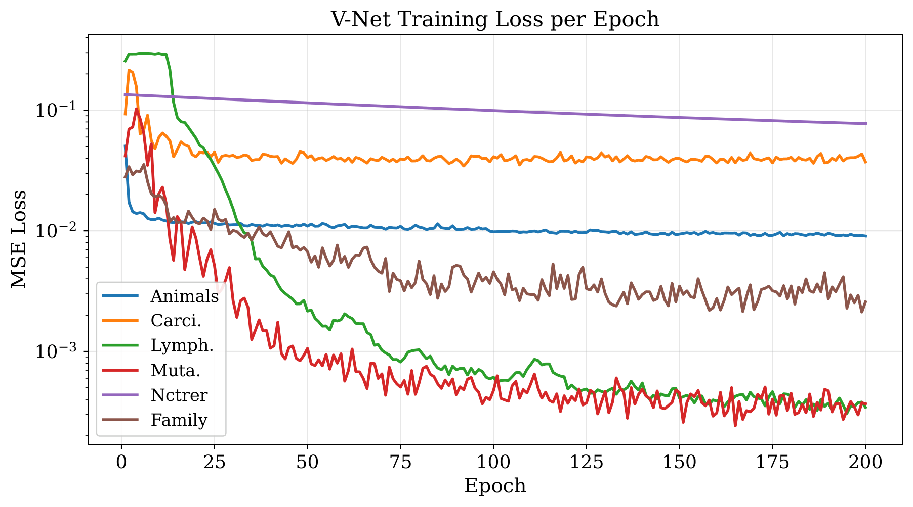

# VoCel Value-oriented Class Expression Learning

> **VoCel-BS** and **VoCel-DR** are concept-learning algorithms that use a lightweight offline-trained **V-Network** to guide beam search, dramatically reducing the number of concepts explored while maintaining solution quality.

---

## Conceptual Overview

The figure below illustrates the key difference between standard neural concept learners (e.g. Drill) and our V-Net guided approach.  
Standard learners evaluate *every* refinement; our V-Net scores candidates *before* evaluation and skips dead-end branches.


---

## Algorithms

### VoCel-BS (`vocell.py`)
Bootstrap-trained V-Net used as a **beam filter** during search.  
The V-Net predicts the best-reachable F1 from each candidate concept and prunes low-promise branches before the expensive SPARQL evaluation step.

### VoCell-DR (`DrillV_Complex` in `main.py`)
Compact V-learning network integrated into the **DrillV** framework.  
Uses `DrillVNet_Complex` (~92K parameters, ×55 smaller than Drill's `DrillNet`) trained with the same offline pipeline.

---

## Installation
 from source:

```shell
git clone https://github.com/dice-group/Ontolearn.git
conda create -n venv python=3.10.14 --no-default-packages && conda activate venv && pip install -e .
# Download knowledge graphs and learning problems
wget https://files.dice-research.org/projects/Ontolearn/KGs.zip -O ./KGs.zip && unzip KGs.zip
wget https://files.dice-research.org/projects/Ontolearn/LPs.zip -O ./LPs.zip && unzip LPs.zip
```

---

## Quick Start

### Step 1 — Generate V-Net training data

Run beam search on every LP and record the search trees (one-time, requires SPARQL endpoint):

```bash
python generate_vnet_dataset.py \
    --lps_file LPs/Family/lps_difficult.json \
    --kb KGs/Family/family.owl \
    --sparql http://localhost:3030/family/sparql \
    --output vnet_search_data_difficult.json
```

### Step 2 — Train the V-Net

**Family dataset (leave-one-out):**
```bash
python train_vocell_v_net.py \
    --lps_file LPs/Family/lps_difficult.json \
    --dataset_file vnet_search_data_difficult.json \
    --embeddings Experiments/embeddings/Keci_entity_embeddings.csv \
    --strategy loocv --epochs 200 --output_dir Family_mean
```

**Other datasets (bootstrap):**
```bash
# Carcinogenesis
python train_vocell_v_net.py \
    --lps_file LPs/Carcinogenesis/lps.json \
    --dataset_file vnet_search_data_carcinogenesis.json \
    --embeddings ../Ontolearn_ISWC/datasets/carcinogenesis/embeddings/DeCaL_entity_embeddings.csv \
    --strategy bootstrap --epochs 200 --output_dir Carcinogenesis_mean

# Mutagenesis
python train_vocell_v_net.py \
    --lps_file LPs/Mutagenesis/lps.json \
    --dataset_file vnet_search_data_mutagenesis.json \
    --embeddings ../Ontolearn_ISWC/datasets/mutagenesis/embeddings/DeCaL_entity_embeddings.csv \
    --strategy bootstrap --epochs 200 --output_dir Mutagegenesis_mean
```

The figure below shows V-Net training loss across all six datasets:



### Step 3 — Run VoCell-BS

```bash
python vocell.py \
    --lps_file LPs/Family/lps_difficult.json \
    --kb KGs/Family/family.owl \
    --sparql http://localhost:3030/family/sparql \
    --embeddings Experiments/embeddings/Keci_entity_embeddings.csv \
    --agg_types mean --training_strategies loocv \
    --beam_width 5 --max_depth 15 --time_limit 600
```

### Step 4 — Run VoCell-DR (DrillV_Complex)

```bash
python main.py \
    --lps_file LPs/Family/lps_difficult.json \
    --kb KGs/Family/family.owl \
    --sparql http://localhost:3030/family/sparql \
    --embeddings Experiments/embeddings/Keci_entity_embeddings.csv
```

---

## V-Net Search Tree Visualisation

You can visualise the V-Net scores on the recorded beam-search tree for any LP:

```bash
# Score nodes and save metadata
python visualize_vnet_tree.py --lp Aunt --top_k 2 --max_depth 6

# Re-plot from saved metadata (no model reload)
python visualize_vnet_tree.py --lp Aunt --top_k 2 --max_depth 6 --load_meta

# Exclude specific concept branches
python visualize_vnet_tree.py --lp Aunt --top_k 2 --max_depth 6 --load_meta \
    --exclude "¬Male" "hasSibling.Grandfather"
```

Each node shows the **concept string**, its measured **F1**, the **V-Net predicted** best-reachable F1, and the ground-truth **GT** (bottom-up DP).  
Green nodes = high V-Net confidence; red nodes = low confidence (dead ends).

The example below shows the search tree for the *Aunt* learning problem (top-2 branches per node, depth 6):


---

## Reproducing Paper Results

All dataset paths, SPARQL endpoints, embedding files, and training hyper-parameters are centralised in [`configs/datasets.yaml`](configs/datasets.yaml).  
The pipeline runner [`run_vocell_pipeline.py`](run_vocell_pipeline.py) reads this config and executes the three steps — **generate → train → evaluate** — for any subset of datasets.

### Prerequisites

1. Start a SPARQL endpoint (e.g. Apache Jena Fuseki) for every dataset you want to reproduce, and verify the URLs match those in `configs/datasets.yaml`.
2. Place entity embeddings at the paths listed in the config (DeCaL embeddings for all datasets except Family, which uses Keci).

### Run the full pipeline

```bash
# All six datasets, all three steps
python run_vocell_pipeline.py

# One or more specific datasets
python run_vocell_pipeline.py --datasets carcinogenesis mutagenesis

# Skip data generation (search-tree JSON files already exist)
python run_vocell_pipeline.py --steps train evaluate

# Dry-run: print every command without executing
python run_vocell_pipeline.py --dry_run
```

### Run individual steps manually

**Step 1 — generate search-tree data** (one-time, requires live SPARQL endpoint):
```bash
python generate_vnet_dataset.py \
    --lp_file  LPs/Carcinogenesis/lps.json \
    --output   vnet_search_data_carcinogenesis.json \
    --kb        KGs/Carcinogenesis/carcinogenesis.owl \
    --sparql    http://localhost:3030/carcinogenesis/sparql \
    --beam_width 10 --time_limit 180
```

**Step 2 — train the V-Net:**
```bash
python train_vocell_v_net.py \
    --lps_file    LPs/Carcinogenesis/lps.json \
    --dataset_file vnet_search_data_carcinogenesis.json \
    --embeddings  ../Ontolearn_ISWC/datasets/carcinogenesis/embeddings/DeCaL_entity_embeddings.csv \
    --strategy    bootstrap --epochs 200 --output_dir Carcinogenesis_mean
```

**Step 3 — evaluate all learners:**
```bash
python examples/concept_learning_drill2_train.py \
    --path_knowledge_base    KGs/Carcinogenesis/carcinogenesis.owl \
    --path_learning_problem  LPs/Carcinogenesis/lps.json \
    --max_runtime 60
```

Results are saved as CSV files under `results/`.

---

## Repository Structure

| Path | Description |
|------|-------------|
| `vocell.py` | VoCell-BS beam search learner |
| `train_vocell_v_net.py` | Offline V-Net training pipeline |
| `generate_vnet_dataset.py` | Search-tree dataset generation |
| `visualize_vnet_tree.py` | V-Net tree visualisation |
| `main.py` | Experimental runner (DrillV_Complex and variants) |
| `run_vocell_pipeline.py` | End-to-end pipeline runner (generate → train → evaluate) |
| `configs/datasets.yaml` | Centralised dataset / path / hyper-parameter config |
| `concept_aggregators.py` | DeepSets / SetTransformer aggregators |
| `Family_mean/` | Pre-trained V-Net checkpoints (Family, LOOCV) |
| `results/` | Experimental result CSVs |
| `LPs/` | Learning problem definitions |
| `KGs/` | OWL knowledge graphs |


